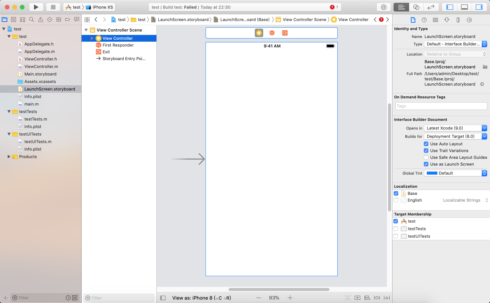

# OCDemo
A summary of commonly used features in iOS.

## 说明
本项目整理了开发中常用的功能，方便日常开发中直接使用。  
项目持续更新中...

项目创建环境：macOS 10.14.2、Xcode 10.1、最低支持 iOS 9.0、Build System: New Build System、使用 Objective-C 语言

## 低于 iOS 9.0 时的错误修复
如果最低支持版本小于 iOS 9.0,会提示 error: Safe Area Layout Guide before iOS 9.0 [12]. 需要在 .storyboard 文件的 Show the File inspector 里面去掉 Use Safe Area Layout Guides 前面的对号。



***

## 手动添加 PCH 文件 

Xcode 6 以后没有自带的 pch 文件，创建步骤:  
1. New File... --> iOS --> Other --> PCH File  
2. 设置pch文件的路径: Targets --> Build Settings --> Prefix Header->设置 $(SRCROOT)/文件在工程中的路  
3. 将Precompile Prefix Header 改为 YES，预编译后的pch文件会被缓存起来，可以提高编译速度

## 将 Single View Application 改成空模板的步骤

Xcode 6之后没有 Empty 选项：  

1. 把工程目录下的 Main.storyboard 删除，ViewController.h、ViewController.m 可以删除也可以保留。
2. 删除 Info.plist 中的 Main storyboard file base name  选项。~~打开工程项目属性文件，点击 Target 下面的第一项，再选择 General选项卡，向下找到 Deployment Info 选项下的 Main Interface 删除 Main。~~
3. Xcode7 以后 Window 上不能放控件，必须在视图上（设置根视图控制器,不然运行时会崩溃）。
4. 在AppDelegate中添加代码 (Markdown 代码块的 "```" 必须和上面的文字空一行代码才能自动换行，不然所有代码都是一行 😳)

  ```
self.window = [[UIWindow alloc] initWithFrame:[[UIScreen mainScreen] bounds]];
self.window.backgroundColor = [UIColor whiteColor];
[self.window makeKeyAndVisible];
self.window.rootViewController = [[UIViewController alloc]init];
```

## 添加 AppIcon 和 LaunchImage

1. 在 Assets.xcassets 中右键 App Icons & Launch Images 选择 New iOS Launch Image。
2. Targets --> General -->  Launch Images Source 改成 LaunchImage，Launch Screen File 改成空。
3. ~~将 LaunchScreen.storyboard 的设置中的 Use as Launch Screen 取消~~

## Xcode 7 iOS 9 适配

### 库后缀替换
1. dylib 后缀的库都要换成 tbd 后缀的

### 支持 http
1. 允许 http 请求，在项目的 info.plist 中添加一个 Key：NSAppTransportSecurity，类型为字典类型。然后给它添加一个Key：NSAllowsArbitraryLoads，类型为 Boolean 类型，值为 YES；
2. 设置域。在项目的 info.plist 中添加一个 Key：NSAppTransportSecurity，类型为字典类型。然后给它添加一个NSExceptionDomains，类型为字典类型。把需要的支持的域添加給NSExceptionDomains，其中域作为Key，类型为字典类型。每个域下面需要设置3个属性：NSIncludesSubdomains、NSExceptionRequiresForwardSecrecy、NSExceptionAllowsInsecureHTTPLoads，均为Boolean类型，值分别为YES、NO、YES。

### 默认需要支持bitcode

1. 暂时关闭对bitcode的支持，Build Settings --> Enable Bitcode
2. 移除不支持bitcode的平台SDK。

### 添加 Scheme 白名单

1. 在项目的info.plist中添加一LSApplicationQueriesSchemes，类型为Array。然后给它添加一个需要支持的项目，类型为字符串类型；

## Xcode 8 iOS 10 适配

1. 自动管理证书，Automatically manage signing
2. 使用 Xcode8 打开 xib 文件后，会提示 Choose an initial device view,选择 Choose Device,然后在 xib 里 Update Frames 更新一下 frame。修改后重新用 Xcode 7 打开会提示 The document "xxx.xib" requires Xcode 8.0 later，需要 Open as -> Source Code 删除 xib 里面 `<capability name="documents saved in the Xcode 8 format" minToolsVersion="8.0"/>`。Xib awakeFromNib 的警告，应该明确的加上 `[super awakeFromNib]`;
3. 有些代码编译不过去，UIWebView 的代理方法，要删除 NSError 前面的 nullable，否则报错。
4. 把插件屏蔽了，内置了注释 option + common + /
5. 需要打开 info.plist 文件添加相应权限的说明，否则程序在iOS 10 上会出现崩溃。Xcode 里选中当前的 target,选择Capabilities,找到Background Modes,打开它,在里面选择对应权限。
6. 字体变大，原有 frame 需要适配。
7. Capabilities 里打开 Push Notifications 开关。
8. 会打印一堆杂乱的 Log，屏蔽的方法如下: Xcode 8 里边 Edit Scheme --> Run --> Arguments, 在 Environment Variables里边添加 OS_ACTIVITY_MODE ＝ Disable 并勾选（不管用取消再勾选一次）。如果我们想知道程序启动的时间，则可以在工程的 scheme 中添加环境变量 DYLD_PRINT_STATISTICS ，值为1。调试过程中可以在控制台打印出程序启动过程中各个阶段所消耗的时间。
9. prefs开头的跳转全部失效

  ```
NSURL *url = [NSURL URLWithString:@"prefs:root=NOTIFICATIONS_ID"];  
if ([[UIApplication sharedApplication] canOpenURL:url]) {
   [[UIApplication sharedApplication] openURL:url];
}
```
替代方法，该页面包含所有和该app相关的隐私信息

  ```
NSURL *url = [NSURL URLWithString:UIApplicationOpenSettingsURLString];
if ([[UIApplication sharedApplication] canOpenURL:url]) {
   [[UIApplication sharedApplication] openURL:url];
}
```

10. 苹果在iOS 2中引入了openURL:方法来进行APP间的跳转。不过在iOS 9中，隐私控制已禁止开发者通过openURL:方法查询设备上是否安装了哪些APP应用。苹果禁止开发者查询设备上是否安装了某款APP。在iOS 10中，苹果弃用了openURL，转而 openURL:options:completionHandler:替代。
11. iOS 10.3 修改APP图标：
    `- (void)setAlternateIconName:(nullable NSString *)alternateIconName completionHandler:(nullable void (^)(NSError *_Nullable error))completionHandler`

## Xcode 9 iOS 11 适配

1. Implicit declaration of function 'sqlite3_rekey' is invalid in C99,sqlite3_rekey头文件位置问题，#import &lt;sqlite3.h&gt; 改为 #import &lt;SQLCipher/sqlite3.h&gt; 缺少C99的头文件，引入#include &lt;sys/time.h&gt; 即可
2. 有的页面在侧滑返回或者pop操作后，会出现页面下沉的现象。tableView的界面错乱、组间距也都乱了，需要先关闭计算行高,在appdelegate.m中直接写：

  ```
//代码块前面的 "```" 要空两格，不然后面的列表序号会重置为1😳
if (@available(iOS 11.0,*)) {
    
    UIScrollView.appearance.contentInsetAdjustmentBehavior = UIScrollViewContentInsetAdjustmentNever;
    UITableView.appearance.estimatedRowHeight = 0;
    UITableView.appearance.estimatedSectionHeaderHeight = 0;
    UITableView.appearance.estimatedSectionFooterHeight = 0;    
}   
```
如果是使用 Storyboard，可以依次 Size Inspector --> Content Insets --> Set 'Never'

3. 相册权限分为访问和添加 `NSPhotoLibraryUsageDescription` `NSPhotoLibraryAddUsageDescription`
4. 如果使用了Masonry 进行布局，就要适配safeArea
5. 对于IM的发送原图功能，iOS11启动全新的HEIC 格式的图片，iPhone7以上设备+iOS11拍出的live照片是 .heic 格式图片，同一张live格式的图片，iOS10发送就没问题（转成了jpg），iOS11就不行
6. 在iOSi11，原有的NSLocationAlwaysUsageDeion被降级为NSLocationWhenInUseUsageDeion。因此，在原来项目中使用requestAlwaysAuthorization获取定位权限，而未在plist文件中配置NSLocationAlwaysAndWhenInUseUsageDeion，系统框不会弹出。建议新旧key值都在plist里配置。
7. iOS11后将searchController 赋值给了NavigationItem，通过属性hidesSearchBarWhenScrolling 可以控制搜索栏是否在滑动的时候进行隐藏和显示
8. UINavigationBar 新增属性 BOOL值 prefersLargeTitles 来实现下面的效果，并可以通过 largeTitleTextAttributes来设置大标题的文本样式。设置大标题之后，导航栏的高度就会由之前的64pt变成 96pt，如果项目中有直接写死的高度或者隐藏导航栏之类的操作，就需要适配一下。
9. 新增 Core ML、ARKit、Named Color
10. iPhone X 适配
	1. 项目中使用状态栏中图标判断当前网络的具体状态出错
	2. 导航栏和标签栏高度变化
	3. touchID 变 faceID
	4. 使用 safeAreaLayoutGuide 和 safeAreaInset就能解决大部分问题
	5. 隐藏底部Indicator
	  
	  ```
	  // 在VC里面重写下面这个方法即可
		- (BOOL)prefersHomeIndicatorAutoHidden{
			return YES;
		}
	  ```
	  
## Xcode 10 iOS 12 适配

1. library not found for -libstdc++.6.0.9，移除了 libstdc++ 这个库，由 libc++ 取代。
2. 有重复的 info.plist 。
3. Multiple commands produce，Xcode --> File --> Project Settings/Workspace Settings --> Build System --> New Build System(Default) 换成 Legacy Build System.  

## 允许 http 请求

```
<key>NSAppTransportSecurity</key>
	<dict>
		<key>NSAllowsArbitraryLoads</key>
		<true/>
		<key>NSExceptionDomains</key>
		<dict>
			<key>freeopen.cc</key>
			<dict/>
			<key>NSIncludesSubdomains</key>
			<true/>
			<key>NSExceptionAllowsInsecureHTTPLoads</key>
			<false/>
			<key>NSExceptionRequiresForwardSecrecy</key>
			<true/>
		</dict>
	</dict>
```

## 配置 Scheme 白名单

### 配置自己的 Scheme
TARGETS --> Info --> URL Types --> URL Schemes 填写自己的 URL Scheme  
当我们集成了第三方应用，比如友盟分享时，他会要求我们按照一个标准来设置应用的 scheme ，这时我们可以根据需要添加多个 scheme 。

### 配置其他应用的 Scheme 白名单

该白名单的个数是否有上限？暂时没有验证

```
<key>LSApplicationQueriesSchemes</key>
	<array>
        <!-- 微信 URL Scheme 白名单 -->
		<string>wechat</string>
		<string>weixin</string>
        
        <!-- 新浪微博 URL Scheme 白名单 -->
		<string>sinaweibohd</string>
		<string>sinaweibo</string>
		<string>sinaweibosso</string>
		<string>weibosdk</string>
		<string>weibosdk2.5</string>
        
        <!-- 腾讯微博 URL Scheme 白名单 -->
        <string>TencentWeibo</string>
        <string>tencentweiboSdkv2</string>
        
        <!-- QQ URL Scheme 白名单 -->
		<string>mqqapi</string>
		<string>mqq</string>
		<string>mqqOpensdkSSoLogin</string>
		<string>mqqconnect</string>
		<string>mqqopensdkdataline</string>
		<string>mqqopensdkgrouptribeshare</string>
		<string>mqqopensdkfriend</string>
		<string>mqqopensdkapi</string>
		<string>mqqopensdkapiV2</string>
		<string>mqqopensdkapiV3</string>
		<string>mqzoneopensdk</string>
		<string>wtloginmqq</string>
		<string>wtloginmqq2</string>
		<string>mqqwpa</string>
        
        <!-- Qzone URL Scheme 白名单 -->
		<string>mqzone</string>
		<string>mqzonev2</string>
		<string>mqzoneshare</string>
		<string>wtloginqzone</string>
		<string>mqzonewx</string>
		<string>mqzoneopensdkapiV2</string>
		<string>mqzoneopensdkapi19</string>
		<string>mqzoneopensdkapi</string>
		<string>mqzoneopensdk</string>
        
        <!-- 支付宝 URL Scheme 白名单 -->
		<string>alipay</string>
		<string>alipayshare</string>
        
        <!-- 钉钉 URL Scheme 白名单 -->
        <string>dingtalk</string>
        <string>dingtalk-open</string>
        
        <!-- Google URL Scheme 白名单 -->
        <string>Google+</string>
        <string>googlechrome</string>
        
        <!-- Facebook URL Scheme 白名单 -->
        <string>fbauth2</string>
        
        <!-- Pocket URL Scheme 白名单 -->
        <string>pocket-oauth-v1</string>
        
        <!-- Instagram URL Scheme 白名单 -->
        <string>instagram</string>
        
        <!-- WhatsApp URL Scheme 白名单 -->
        <string>whatsapp</string>
        
        <!-- Line URL Scheme 白名单 -->
        <string>line</string>
	</array>
```

## 隐私权限描述

iOS 10 及以后需要在 Info.plist 里添加隐私权限描述

```
    <!-- 隐私权限描述 -->
    <key>NSLocationUsageDescription</key>
    <string>是否允许此 App 使用您的位置？</string>
    <key>NSLocationWhenInUseUsageDescription</key>
    <string>是否允许此 App 在使用期间访问位置？</string>
    <key>NSLocationAlwaysUsageDescription</key>
    <string>是否允许此 App 始终访问位置？（iOS11 已降级为使用期间）</string>
    <key>NSLocationAlwaysAndWhenInUseUsageDescription</key>
    <string>是否允许此 App 始终访问位置？</string>
    
    <key>NSContactsUsageDescription</key>
    <string>是否允许此 App 访问你的通讯录？</string>
    
    <key>NSCalendarsUsageDescription</key>
    <string>是否允许此 App 访问日历？</string>
    
    <key>NSRemindersUsageDescription</key>
    <string>是否允许此 App 访问提醒事项？</string>
    
    <key>NSPhotoLibraryUsageDescription</key>
    <string>是否允许此 App 读写照片？</string>
    <key>NSPhotoLibraryAddUsageDescription</key>
    <string>是否允许此 App 添加照片？</string>
    
    <key>NSBluetoothPeripheralUsageDescription</key>
    <string>是否允许此 App 使用蓝牙？</string>
    
    <key>NSMicrophoneUsageDescription</key>
    <string>是否允许此 App 使用麦克风？</string>
    
    <key>NSSpeechRecognitionUsageDescription</key>
    <string>是否允许此 App 使用语音识别？</string>
    
    <key>NSCameraUsageDescription</key>
    <string>是否允许此 App 使用相机？</string>
    
    <key>NSHealthShareUsageDescription</key>
    <string>是否允许此 App 读取健康数据？</string>
    <key>NSHealthUpdateUsageDescription</key>
    <string>是否允许此 App 写入健康数据？</string>
    
    <key>NSHomeKitUsageDescription</key>
    <string>是否允许此 App 访问住宅数据？</string>
    
    <key>NSAppleMusicUsageDescription</key>
    <string>是否允许此 App 访问媒体资料库？</string>
    
    <key>NSMotionUsageDescription</key>
    <string>是否允许此 App 读取运动与健身数据？</string>
    
    <key>NSSiriUsageDescription</key>
    <string>是否允许此 App 使用 Siri？</string>
    <!-- 隐私权限描述结束 -->
```

## 添加常用文件夹

1. 本地新建文件夹，拖入项目中时，选择 `Copy items if needed`、`Create groups`、`Add to targets 第一个`
2. File --> New Group 新建 Supporting Files 文件夹，将 `LaunchScreen.storyboard`、`Info.plist`、`main.m`、`OCDemo-Prefix.pch` 移到文件夹中。
3. 修改 pch 路径，TARGETS --> Build Settings --> Prefix Header。
4. 修改 plist 路径，TARGETS --> Build Settings --> 选中 All 和 Combined --> Packaging --> Info.plist File 修改路径。

## 国际化和本地化

1. 在信息技术领域，国际化与本地化（英文：internationalization and localization， 简称成 i18n 及 L10n）是指修改软件使之能适应目标市场的语言、地区差异以及技术需要。
2. 国际化是指在设计软件，将软件与特定语言及地区脱钩的过程。当软件被移植到不同的语言及地区时，软件本身不用做内部工程上的改变或修正。
3. 本地化则是指当移植软件时，加上与特定区域设置有关的信息和翻译文件的过程。

### 添加要支持的国际语言

1. PROJECT --> Info --> Localizations 点击 + 添加需要支持的语言,选择对应 storyboard 文件，点击 Finish。默认 Development Language 是英语。

### 系统配置的本地化（App 名称、隐私权限描述……）
1. New File... --> iOS --> Resource --> Strings File --> Next --> 命名为 InfoPlist.strings（必须命名为InfoPlist）。
2. 选中 InfoPlist.strings，展开右边 Show the File inspector,保证第一步已经添加了对应语言，Localization 中点击 Localize... ，弹出确认对话框，选择 Localize，如果有多种语言，然后勾选其他需要的语言。
3. 在对应语言文件中按 key-value 的形式写入需要本地化的字符串，key 可以加引号也可以不加，value 需要加引号,以分号结尾。  
`"CFBundleDisplayName" = "演示代码";`  
`"NSPhotoLibraryUsageDescription" = "需要打开相册";`

### 文本的本地化

1. New File... --> iOS --> Resource --> Strings File --> Next --> 命名为 Localizable.strings（必须命名为Localizable）。
2. 在对应语言文件中按 key-value 的形式写入需要本地化的字符串。  
3. 使用NSLocalizedString按照给定的 key 查找对应 strings 文件时，如果找不到该 key 对应 value 时，默认返回的值就是 key。
`"button" = "按钮";`
`NSLocalizedString(<#key#>, <#comment#>)`
`NSLocalizedString(@"button", nil)];`
`NSLocalizedString(@"sampleText", @"这是个测试");`

### 自定义 .strings 文件名

1. New File... --> iOS --> Resource --> Strings File --> Next --> 命名为 MyLocalized.strings（可以自定义命名）。
2. 使用 `NSLocalizedStringFromTable(<#key#>, <#tbl#>, <#comment#>)` 
`NSLocalizedStringFromTable(@"MySampleText", @"MyLocalized", @"自定义国际化资源");`

### 国际化数据格式

不同的国家和地区有着不同的日期，时间，货币，数值等的格式，所以要在代码中根据用户设置的地区来正确的格式化这些数据。
格式化时用到 NSLocale 类，NSLocale 类封装了某一个地区的相应的格式化信息，如果要获得用户当前设置地区的 NSLocale 实例可以使用 [NSLocale currentLocale] 或者 [NSLocale autoupdatingCurrentLocale]，两者的区别是，后一个类方法返回的值会根据用户设置的改变而改变，而前者不会。

### 支持相反的语言方向

有一些语言，比如阿拉伯语等，方向是从右向左的。使用
Base Internationalization和Auto Layout在大部分情况下可以很好的支持这些语言，一些不支持的情况，可以在代码中进行如下判断：
`if ([UIView userInterfaceLayoutDirectionForSemanticContentAttribute:view.semanticContentAttribute] == UIUserInterfaceLayoutDirectionRightToLeft)
`

### 修改默认 Development Language

1. 将info.plist文件中CFBundleDevelopmentRegion(Localization native development region)修改为zh-Hans或China(修改为China，Xcode会转换为zh_CN)
2. 使用文本编辑器打开.xcodeproj -> project.pbxproj路径的文件，将English修改为zh-Hans
3. 重新打开程序即可，PROJECT -> info -> Localizations路径下，默认开发语言修改为Chinese(Simplified)-Development Language;

## 自定义字体

1. 字体文件名不代表字体的名字。
2. 将下载的字体 .ttf 文件导入工程中。
3. 在 `Info.plist` 中添加 `Fonts provided by application` 类型为 Array，Item 填写字体文件名称加后缀，字段的值是字体文件的名字，不是字体名字。
4. ~~TARGETS --> Build Phases --> Copy Bundle Resources 添加字体文件。~~
5. 找到字体文件对应的 `fontName`
   1. 选中该字体文件，右键显示简介，在通用的下面找到**全名**这一项就是字体的名字。（如果全名是中文有可能不准，`站酷快乐体`字体名其实是`HappyZcool-2016`）
   2. 通过代码打印所有字体名找到该文件的字体名：
     
     ```
     NSArray *familyNamesArray = [UIFont familyNames];
    for (NSString *familyNames in familyNamesArray) {
        
        NSArray *fontNamesArray = [UIFont fontNamesForFamilyName:familyNames];
        
        for (NSString *fontName in fontNamesArray) {
            
            NSLog(@"fontName==%@",fontName);
        }
    }
    
     ```
     
6. 使用 `[UIFont fontWithName:<#(nonnull NSString *)#> size:<#(CGFloat)#>]` 调用字体。  
   `[UIFont fontWithName:@"Source Han Serif" size:20.0];`
   
## 添加头文件、分类、扩展

1. 头文件：New File... --> iOS --> Source --> Header File
2. 分类：New File... --> iOS --> Source --> Objective-C File --> Next --> File Type 选择 Category --> Class 选择类名 --> File 输入分类的名字，只需输入你为分类起的名字
3. File Type 共四个选项 `Empty File` `Category` `Protocol` `Extension`
4. 扩展：步骤同分类，只需要在 File Type 选择 Extension，扩展只有 `.h` 文件，没有 `.m` 文件
5. Release 模式去除 NSLog
  
  ```
//消除 Release 模式的 NSLog
#ifdef DEBUG
#define NSLog(...) NSLog(__VA_ARGS__)
#else
#define NSLog(...)
#endif
```

## GitHub 自动识别语言不准确修改方法

GitHub 识别语言是根据仓库中使用最多的语言类型，没有直接修改的设置，`README.md` 文本过多，就会被识别为 `HTML` 。

在仓库根目录下新建 `.gitattributes` 文件，添加以下代码：

```
*.js linguist-language=Objective-C
*.css linguist-language=Objective-C
*.html linguist-language=Objective-C
```

这表示将 js、css、html 代码按照 Objective-C 语言统计。

## 添加 CocoaPods

Search for pods (above). Then list the dependencies in a text file named Podfile in your Xcode project directory:

```
platform :ios, '8.0'
use_frameworks!

target 'MyApp' do
  pod 'AFNetworking', '~> 2.6'
  pod 'ORStackView', '~> 3.0'
  pod 'SwiftyJSON', '~> 2.3'
end
```

Tip: CocoaPods provides a `pod init` command to create a Podfile with smart defaults. You should use it.

Now you can install the dependencies in your project:

>$ pod install  

Make sure to always open the Xcode workspace instead of the project file when building your project:

>$ open App.xcworkspace

Now you can import your dependencies e.g.:

>\#import &lt;Reachability/Reachability.h&gt;

## 创建代码片段

将需要创建的代码块写好，可以使用 `<#name#>` 添加占位符，选中整个代码片段，右键，`Create Code Snippet` 。

+ Title：代码块的名字
+ Summary：简介
+ Platform：All
+ Language：Generic
+ Completion Shortcut：快速输入代码
+ Completion Scopes：选择范围

选择 Xcode 左上方的 `{}` 图标，可以找到对应代码块，左键点击可以编辑，键盘 delete 可以删除。


